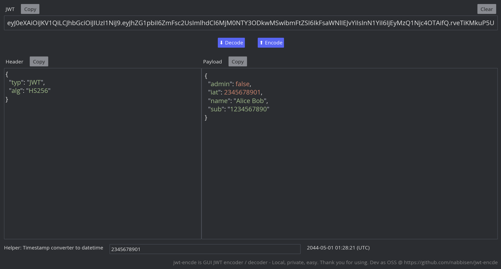

# jwt-encde

[](https://crates.io/crates/jwt-encde)
[](https://deps.rs/crate/jwt-encde)
[](https://github.com/nabbisen/jwt-encde/actions/workflows/release-executable.yaml)
[](https://github.com/nabbisen/jwt-encde/blob/main/LICENSE)

GUI JWT encoder / decoder - Local, private, easy.



## Description

A lightweight, open-source GUI tool for JWT encoding and decoding, designed to support testing around authentication and authorization in app development.

This app allows you to **inspect, analyze, and edit JWT payloads as JSON**, and easily convert test JSON data into JWTs for development and debugging purposes.    

### Key features

- Runs entirely **offline**, unlike online tools
    - It strongly ensures **security and privacy**. No data ever leaves your machine.
- Built with a **low-memory, high-performance architecture** 
- Available as a **cross-platform binary** for Windows, macOS, and Linux

#### Additional features included

- Syntax highlighting for JSON to improve readability
- Disabled states for unavailable actions to prevent accidental operations
- A built-in helper tool for analyzing UNIX timestamps within JSON data

#### Note: This app does **not** support JWT signing or token introspection

In real-world systems, signing keys and token validation are typically managed by IDaaS. They should be verified through actual integration with the provider.

## Usage options

- Download executable and just run it
    - [Assets](https://github.com/nabbisen/jwt-encde/releases/latest) in GitHub Releases are avalilable
-  Install via Rust cargo
    
    ```sh
    cargo install jwt-encde
    jwt-encde
    ```

## Open-source, with care

This project is lovingly built and maintained by volunteers.
We hope it helps streamline your work.
Please understand that the project has its own direction — while we welcome feedback, it might not fit every edge case 🌱

## Acknowledgements

Depends on the crates of [arboard](https://crates.io/crates/arboard), [base64](https://crates.io/crates/base64), [iced](https://crates.io/crates/iced), [json5](https://crates.io/crates/json5), [jsonwebtoken](https://crates.io/crates/jsonwebtoken), [serde](https://crates.io/crates/serde), [serde_json](https://crates.io/crates/serde_json), [webbrowser](https://crates.io/crates/webbrowser).
